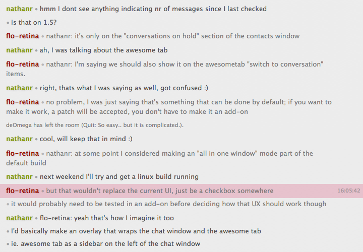

This message style is still in the development stages, expect some issues if you use this.

Sanity is meant to please my personal preference in having a sane yet visually pleasing message style for Instantbird.

It darkens the nicknames of participants slightly so that the contrast is better on a light background. It also
highlights new messages from users as well as when hovering over past messages using their respective color.
